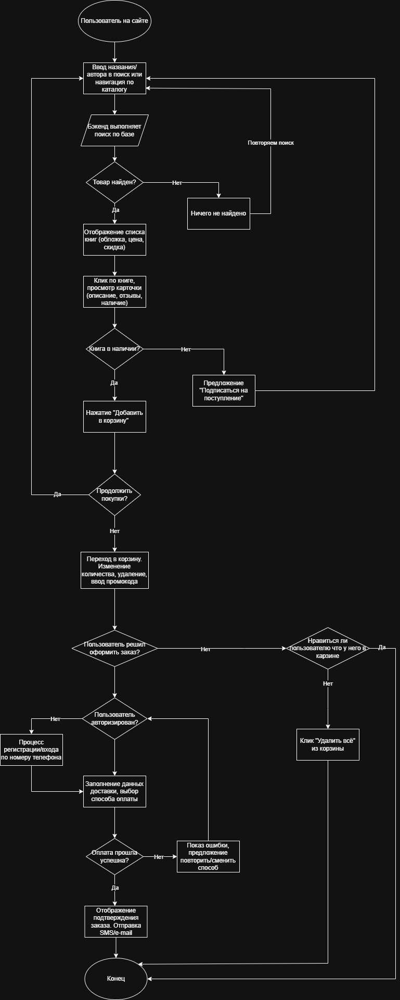

# Анализ и стратегия развития интернет-магазина Book24.ru

**Роль:** BA/PM
**Продукт:** Книжный интернет-магазин Book24.ru (официальный магазин издательской группы «Эксмо-АСТ»)
**Дата:** 2026

## Содержание
1.  [Часть 1. Анализ текущего состояния](#часть-1-анализ-текущего-состояния)
    - [1.1. Основные функции и пользователи](#11-основные-функции-и-пользователи)
    - [1.2. Схема ключевого процесса](#12-схема-ключевого-процесса)
    - [1.3. Пользовательские боли и проблемы](#13-пользовательские-боли-и-проблемы)
2.  [Часть 2. Стратегия и AI-идеи](#часть-2-стратегия-и-ai-идеи)
    - [2.1. Product Vision](#21-product-видение)
    - [2.2. Стратегическая цель на год](#22-стратегическая-цель-на-год)
    - [2.3. Генерация AI-идей](#23-генерация-ai-идей)
    - [2.4. Выбор лучшей идеи](#24-выбор-лучшей-идеи)
3.  [Часть 3. Рефлексия использования AI](#часть-3-рефлексия-использования-ai)
    - [3.1. Промпты и анализ](#31-промпты-и-анализ)

---

## Часть 1. Анализ текущего состояния

### 1.1. Основные функции и пользователи

Book24.ru - это интернет-магазин издательской группы Эксмо-АСТ. На их сайте продаются книги издателей таких как «Эксмо» и «АСТ», «Манн, Иванов и Фербер», «Азбука», «Альпина», «Синдбад».
А также они взаимодействуют с «БОМБОРА», «Corpus», «Mainstream», «Редакция Елены Шубиной», «Вилли-Винки», «Fanzon», «Комильфо» и «Канц-Эксмо». 
Они также являются издателями книг и поэтому знают когда выходят новые книги и получаем их первыми, что позваляет им формировать свои цены на данную продукцию.

**Основная функция:** Предоставить максимально широкий и удобный канал для поиска, выбора и покупки книг(печатный вариант и аудиокниги), канцелярии и других товаров с удобной доставкой по всей России, используя инструменты лояльности и контентной поддержки (обзоры, рейтинги, подборки).
Доставка осуществляется на свои пункты выдачи, почтой, а также можно получить из рук курьера.

**Основные сегменты пользователей и их потребности:**
1.  **Активные читатели (ядро аудитории):** Люди, для которых чтение — основное хобби. Они следят за новинками, бестселлерами, творчеством любимых авторов. Их потребность — быть в курсе новинок любимых авторов и серий, удобно ориентироваться в большом ассортименте, получать персонализированные рекомендации, участвовать в программе лояльности.
2.  **Покупатели подарков и нишевых товаров:** Люди, которые ищут книгу в подарок, или покупают товары для хобби (канцелярию, творчество), литературу для саморазвития. Их потребность — быстрый и понятный поиск по тематикам, поводам, возрастным категориям, наличие подарочных изданий и сопутствующих товаров в одном заказе.
3.  **Эпизодические/новые пользователи:** Пришли по акции, за конкретной книгой из списка или по рекомендации. Им важна простая навигация, выгодное первое предложение (как скидка 30% за регистрацию) и понятные условия доставки.

### 1.2. Схема ключевого процесса

Для анализа был выбран процесс **"Поиск и покупка книги"**.

**Блок-схема процесса**

**Пошаговое пояснение к схеме(некоторые этапы объединены):**

1.  **Вход на сайт (Начало):** Пользователь попадает на главную страницу, где видит новинки, бестселлеры, подборки.
2.  **Поиск нужной книги:** Пользователь либо вводит название/автора в строку поиска, либо использует навигацию по каталогу, тематическим подборкам или рейтингам.
3.  **Система выполняет поиск:** Бэкенд ищет совпадения в базе товаров.
4.  **Проверка наличия результатов:**
    *   *Альтернативный путь (Ничего не найдено):* Пользователь видит сообщение «К сожалению, по вашему запросу «ЗАПРОС» мы ничего не нашли.», под этим сообщение он видит «Но, возможно, вам будут интересны эти товары:», где ему предложат похожие запросы. Также на этом сайте допустив ошибку в названии книги, будет отображён текст который я описал ранее о том что ничего не было найдена, ведь на сайте не была добавлена корректура текста. Хотя в предложенных книгах снизу она скорее всего будет отображена, смотреть ([скриншот](other/screenshot_from_book.jpg)). Но если допустить опечатку на авторе то скорее всего сайт опустит слово с ошибкой и выведет всех авторов у которых имеются похожее имя или фамилия как указанно на ([скриншоте](other/screenshot_about_authors.jpg)). Иначе если не находим товар или автора то возращаемся к шагу 2.
5.  **Отображение результатов поиска:** Пользователь видит список найденных книг с обложками, авторами, ценами и процент скидки на данную книгу.
6.  **Выбор книги и просмотр карточки:** Пользователь кликает на книгу, видит подробное описание(цену, характеристику, обложку), отзывы и оценки(пользовательские и рейтинг экспертов), информацию о наличии.
7.  **Добавление в корзину:** Пользователь нажимает «Добавить в корзину» или «Отложить в избранное».
    *   *Исключение:* Книга может не быть в наличии что указывает надпись «Нет в наличии». Можно указать свою почту и на неё придёт сообщение о поступлении товара на сайт.
8.  **Продолжение или оформление заказа:** Пользователь либо продолжает покупки (возврат к шагу 2), либо переходит в корзину.
9.  **Переход в корзину:** Пользователь видит все книги (название, автора, обложку, цену) добавленные им в корзину, пользователь решает в каком количестве экземпляров он хочет купить каждую из книг, видит общую стоимость, имеет возможность удалить книгу из корзины или перенести её в избранные, сохраняя возможность покупки в будущем, может ввести промокод для получения бонуса.
    *   *Альтернативный путь (пользователь передумал что либо покупать):* Пользователь решает что ничего заказывать не будет и полностью очищает корзину кликнув «Удалить всё» или просто выходит из сайта
    *Примечание* Пользователь даже неавторизованный может добавлять товары в корзину, что говорит о том что сайт создал уникальный номер для моего браузера с записью в базе данных, что и позволяет неавторизованному пользователю добавлять в корзину товары.
10.  **Оформление заказа:** Кликнув «Перейти к оформлению» пользователь заполняет данные для доставки, выбор способа оплаты и доставки. 
    *   *Альтернативный путь (Пользователь не авторизовался):* Если пользователь не авторизирован, то сайт не даст ему оформить заказ поэтому пользователь регистрируется или заходит в уже зарегистрированный аккаунт.
    *   *Регистрация* Регистрация пользователя происходит быстро. Пользователь вводит свой номер телефона на который приходит смс с подтверждение, вводя свой номер пользователь даёт согласие на обработку персональных данных
11.  **Подтверждение и оплата заказа:** Пользователь проверяет все данные и подтверждает заказ. При онлайн-оплате происходит списание средств.
    *   *Альтернативный путь (Ошибка оплаты):* Платеж не прошел. Пользователь видит сообщение об ошибке с предложением повторить или выбрать другой способ.
12. **Заказ оформлен:** Пользователь видит подтверждение, получает письмо/смс с деталями заказа. 

**Процесс завершен.**

### 1.3. Пользовательские боли и проблемы

На основе анализа типичных проблем книжных интернет-магазинов и специфики Book24 можно выделить:

1.  **Плохо оптимизированная обработка пользовательских опечаток в поиске.** При вводе в поисковой строке название книги с ошибкой то в результате пользователь не увидит искомого товара, а увидит сообщение «К сожалению, по вашему запросу «ЗАПРОС» мы ничего не нашли.», хотя ниже в предложенных товар что он искал может быть предложен один из первых, что будет приводить к росту показателей пустых поисковых запросов, ухудшает пользовательский опыт и снижение конверсии из поиска в корзину. Также и для поиска по автору если указать правильно имя автора и ошибиться в фамилии то алгоритм поиска просто убирает фамилию искомого человека и оставляют имя, выдавая книги не только искомого автора а ещё других авторов с таким же именем, что также снижает конверсию из поиска, ухудшает пользовательский опыт и клиенту будет проще и быстрее уйти к конкуренту с более умным поиском.
2.  **Несогласованность контента заполненности карточки товара:** На сайте отсутствует единый стандарт наполнения карточек книг. Для части товаров (обычно новинок или хитов) доступны ознакомительные фрагменты ("эффект листания"), есть несколько отзывов. Однако для значительной части ассортимента (старые издания, нишевая литература) пользователь видит только обложку, цену и краткое описание, редко когда есть хоть один отзыв. Этого недостаточно для принятия решения о покупке, особенно если книга незнакомая или дорогая, что приводит к снижению конверсии из просмотра в корзину и перекосу покупок книг уже являющимися хитами, бестселлерами.

## Часть 2. Стратегия и AI-идеи

### 2.1. Product Видение

Создать интеллектуальный гид в мире печатных и цифровых книг, где граница между выбором, покупкой и чтением стирается ради главного — сэкономленного времени читателя и радости от открытий.

### 2.2. Стратегическая цель на год

  **Цель:** увеличить коэффициент удержания новых пользователей и улучшить пользовательский опыта новых пользоваиелей
  **Почему имеено её** Что касается книг мне кажется лучше сосредоточиться на количестве заказов книг, создав удобный поиск, ведь намного чаще пользователи ищут что то конкретное, особенно если не нашли нужную книгу в библиотеке или маркетплейсе, чем просматривают что является бестселлером или хитом или рекомендацией. 

### 2.3. Генерация AI-идей

1. **Умный рекомендательный алгоритм «Книжный психолог»**

*Проблема возникшая у пользователя* Пользователь не знает, что хочет почитать. Поиск по жанрам часто не помогает, так как настроение не всегда соответствует конкретному жанру (например, хочется «легкой грусти» или «бодрого утра»).
*Как это работает:* ИИ задает уточняющие вопросы: «Какое у вас настроение?», «Сколько времени есть на чтение?», «Назовите последнюю книгу, которая вам понравилась, и объясните, чем». На основе обработки естественного языка (NLP) и анализа тональности, а также данных о книгах (аннотации, теги, отзывы) нейросеть подбирает варианты, объясняя свой выбор: «Вы ищете что-то вдохновляющее, как "Зеленый свет" Мэттью Макконахи, но у вас мало времени — попробуйте сборник рассказов Наринэ Абгарян».

2. **Умный поиск «Найди книгу по описанию»**

*Проблема:* Классический пример: «Помню, книга синяя была, там про девочку и поезд, кажется, что-то скандинавское». Найти книгу по таким запросам в обычном поиске невозможно.
*Как это работает:* Пользователь пишет запрос максимально коряво и описательно (voice-to-text или текстом). ИИ преобразует этот запрос в векторы и ищет совпадения по метаданным книг, рецензиям и даже цитатам внутри книг (если есть доступ к текстам). Модель понимает контекст: «поезд» = путешествия/Хемингуэй/Агата Кристи, «синяя» = обложка или настроение?

3. **«Идеальный подарок» — ИИ-подборщик подарочных изданий**

*Проблема:* Выбор книги в подарок — стресс. Нужно угадать вкус человека, который не всегда совпадает с вашим, и при этом книга должна выглядеть презентабельно.
*Как это работает:* Пользователь вводит данные о получателе (возраст, хобби, последняя прочитанная книга, если известно, или  "дальнобойщик, 45 лет"). ИИ анализирует базу и предлагает не просто книгу, а комплект: «Книга [Название] + стильная закладка + подарочная упаковка», аргументируя: «Судя по профессии, ему может быть близка тема дороги и свободы, рекомендуем издание с картами в кожаном переплете».

### 2.4. Выбор лучшей идеи

**(Идею №1) Умный рекомендательный алгоритм «Книжный психолог»**

*   **Обоснование:** Если исправить поиск книг по автору и названию, то этого будет достаточно и не нужно создавать умный поиск в следующую очередь, хоть он всё ещё остаётся важной частью для увеличения коэффициента удержания пользователей на сайте за счёт удобного поиска, но и улучшать пользовательский опыт использования сайта крайне важно.
*   **Польза:** Пользователи не знающие что купить и желающие найти что то интересное просмотрев небольшой список рекомендаций сайта по бестселлерам и хитам, не найдя ничего интересного могут продолжить бездумно листать так ничего не найдя и не сделав заказ, а так алгоритм ему как консультант задав пару вопросов может порекомендовать и расписать эту книгу интересно что захочется её купить.
*   **Реалистичность:** Требует разработки интерфейса для диалога (например, простой чат или последовательность вопросов) и интеграции с NLP-моделью для анализа ответов. Модель должна уметь сопоставлять тональность ответа с тегами книг (жанр, настроение, темп). Это сложная, но решаемая задача, особенно если использовать уже существующие API больших языковых моделей (LLM) и дообучить их на своих данных (аннотации, теги, отзывы). 
*   **Отказ:** Отказать можно от идеи №3 "«Идеальный подарок» — ИИ-подборщик подарочных изданий" ведь его решаемые проблемы будет хорошо выполнять идея №1 "Умный рекомендательный алгоритм «Книжный психолог»", а идея №2 может развить споры насчёт авторских прав, по этому с ней лучше повременить и узнать насколько хорошо сайт сотрудничает с авторами что бы получить права для обучения модели по их работам. 

## Часть 3. Рефлексия использования AI

В ходе выполнения задания я активно использовал AI-инструменты, использовался только одну языковую модель Deepseek, как по мне самая удобная модель.

### 3.1. Промпты и анализ

## 1. На каких этапах AI помог?

### Структурирование проекта (prompt_1.txt)
AI помог понять, как правильно организовать репозиторий на GitHub, в какие папки что положить. Это сэкономило время на изучение оформлению гитхаба.

### Анализ пользователей (prompt_2.txt)
AI предложил основных пользователей книжных магазинов, которую я взял за основу и дополнил своими наблюдениями. Особенно полезными оказались описания потребностей разных групп.

### Создание блок-схемы (prompt_3.txt)
AI подсказал, как визуализировать процесс покупки в draw.io, какие элементы включить и где расписать можно было мои наблюдения в несколько пунктов.

### Оформление BA-части (prompt_4.txt)
AI помог структурировать аналитические документы, разбить их на логические разделы и оформить в гитхабе.

### Product Vision (prompt_5.txt)
AI сгенерировал несколько вариантов видения, из которых я выбрал наиболее подходящий.

### Генерация AI-идей (prompt_6.txt)
AI предложил 5 конкретных идей по улучшению магазина с помощью AI. Некоторые из них я взял полностью, некоторые совсем не рассматривал для того что бы подошло магазину именно сейчас, от оставшихся я взял идею и расписал как её вижу я.

## 2. Где я опирался только на свой опыт?

### Тестирование поиска на сайте
Я сам проверил, как работает поиск при опечатках в названиях и фамилиях авторов. Сделал скриншоты, которые подтверждают проблемы. AI не может заменить реальное тестирование продукта.

### Анализ карточек товаров
Я сам сравнивал наполнение карточек у разных книг (новинки vs нишевые издания) и делал выводы о несогласованности контента. AI может предложить общие идеи, но конкретные наблюдения — только руками.

### Выбор лучшей AI-идеи
AI сгенерировал 5 идей, но решение, какую из них реализовывать первой, принимал я, основываясь на:
- реалистичности внедрения
- соответствии выявленным проблемам
- на выполнености стратегической цели на год

### Формулировка стратегической цели
Цель про увеличение удержания пользователей и улучшение поиска я сформулировал сам, исходя из того, что именно эти проблемы я выявил при анализе.

## 3. Что нового я узнал?

1. **Как работают поисковые алгоритмы** — на практике увидел, что поиск на Book24 не исправляет опечатки и некорректно обрабатывает ошибки в фамилиях авторов.

2. **Как AI может помогать аналитику** — AI отлично подходит для генерации идей и структурирования, но не заменяет реальное исследование продукта.

3. **Важность единого стандарта контента** — раньше не задумывался, насколько сильно отсутствие ознакомительных фрагментов влияет на решение о покупке нишевых книг.

4. **Как много и чётко необходимо продумывать делали** - ведь и взаправду для новых пользователей не нашедшим нужный им продукт скорее всего выйдут их этого сайта и никогда туда не вернуться.

5. **Что некоторые сайты создают ячейку в бд для незарегестрированных пользователей** - что позволяет пользователям делать выборы на сайте выбрав нужный продукт и когда останеться только оплатить, тут и можно добавить регестрацию и авторизацию на сайт, ведь человек уже вложил силы и с меньшей вероятностью захочет покинуть сайт без выбранного товара.

*Примечание:* что натолкнуло меня на мысль что нужно придумать что-то настолько интересное что создаст у пользователя иллюзию владения этой вещью и он так не захочет с ней расстоваться что купит её с большей вероятностью, но покачто всё что приходит в голову, возможно эту идею осуществит 3D книга, котрую можно покрутить вокруг своекй оси как настоящую возможно даже полистать, но это покачто спорно, создавать для каждой книги её 3D выйдет дороговато, но если суметь создать общий корказ и на фотошопе приделать для каждой картинки боковую сторону, и уменьшать(увеличивать) ширину и длину книги на ползунках ,то это выйдет не так дорого, а если им будет лень эти заниматься и у их досточно денег то можно заключить с ними договор, что компания будет делать им 3D модели книг (самой составив программу для лёгкого 3D образной книги) и брать там по 5000 тысяч долларов в месяц, платя сотруднику что будет этим заниматься 1000, я думаю это хорошая идея, даже реализуемая, жаль что она пришла ко мне в голову когда я закончиваю заполнять документ.

6. **Что промпты нужно сохранять** — это важная часть тестового задания, показывает проверяющим, как использовались нейросети)

