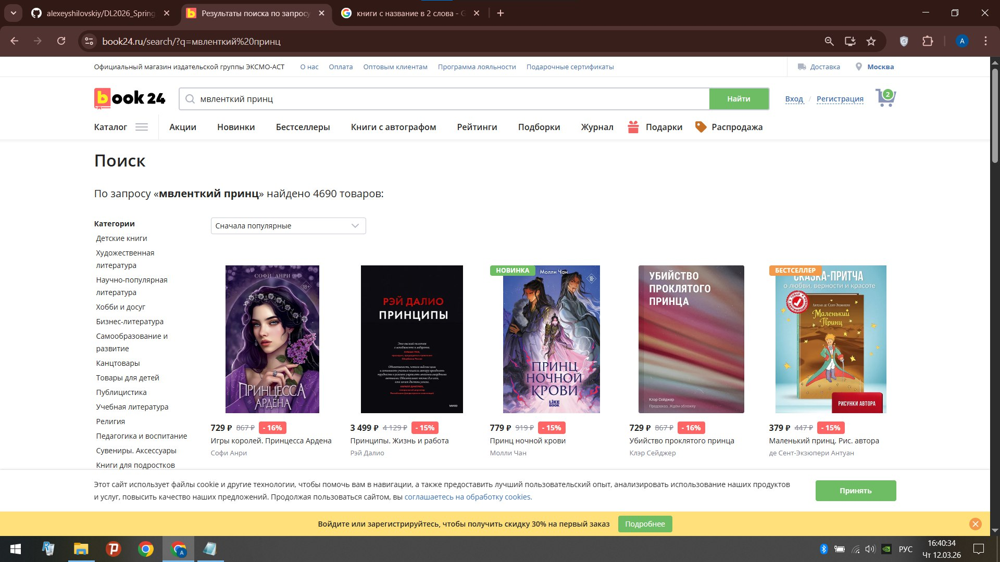
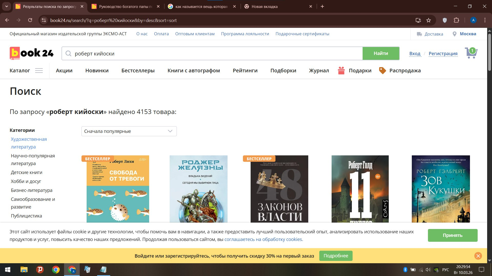

# Пользовательские истории (User Stories)

На основе анализа поведения сайта Book24.ru выявлены следующие пользовательские сценарии:

## Epic: Поиск книг

**US-001: Поиск по названию с опечаткой**
> Как пользователь,
> Я хочу, чтобы поиск находил книгу, даже если я ошибся в названии,  
> Чтобы мне не приходилось исправлять запрос или искать вручную.

**Подтверждение проблемы:**
При вводе «мвленткий принц» (вместо «маленький принц») поиск не находит книгу сразу, хотя она есть в базе.

---

**US-002: Поиск по автору**
> Как пользователь,  
> Я хочу, чтобы поиск находил книги конкретного автора, даже если я ошибся в фамилии,  
> Чтобы в результатах были только его книги.

**Подтверждение проблемы:**
При поиске «роберт кийоски» (вместо «Роберт Кийосаки») поиск выдает книги всех авторов с именем Роберт.

---

## Epic: Принятие решения о покупке

**US-003: Ознакомление с содержанием**
> Как пользователь, рассматривающий незнакомую книгу,  
> Я хочу видеть ознакомительный фрагмент или несколько страниц,  
> Чтобы понять, подходит ли мне эта книга по стилю.

**Подтверждение проблемы:**
На сайте ознакомительные фрагменты есть не у всех книг, особенно у старых или нишевых изданий.

---

**US-004: Отзывы других читателей**
> Как пользователь, сомневающийся в покупке,  
> Я хочу читать отзывы других покупателей,  
> Чтобы принять более взвешенное решение.

**Подтверждение проблемы:**
У некоторых книг отзывы отсутствуют полностью, у других — их несколько, смотрите на скриншот выше.

